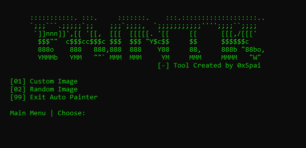

# Starving Artists Auto Painter

This is a tool that allows you to auto-paint images in the Roblox game "Starving Artists". It processes your selected images (by file or URL), resizes your window to fit all resolutions, and automatically starts painting by coordinate! This is a hobby project and will most likely not be maintained.

## Features

1) Adapts to screen resolution
2) Easy-to-use interface
3) Import images by file, web or API
4) Undetected by the anti-cheat
5) Ability to use all custom brushes
6) Earn real money!

## Installation

To install the project from GitHub, follow these steps:

1. **Clone the Repository**: Open your terminal/command prompt in the directory where you want to store the project. Then, run the following command:

    ```
    git clone https://github.com/0xSpai/RobloxAutoPainter.git
    ```

2. **Navigate to the Project Directory**: Change your current directory to the newly cloned project directory:

    ```
    cd RobloxAutoPainter
    ```

3. **Install Dependencies**: Run the "setup.bat" file to install all dependencies. Alternatively, you can paste this in the terminal:

    ```
    pip install -r requirements.txt
    ```

4. **Run the Project**: If everything has installed smoothly up until now, all you have to do is run the python script!

    ```
    python paint.py
    ```

5. **Feedback and Contributions**: If you encounter any issues or have suggestions for improvements, open a GitHub issue or contribute directly!

## Usage

Firstly, join the [Starving Artists game](https://www.roblox.com/games/8916037983/starving-artists-DONATION-GAME#!/about) and claim a booth. Sit down at the painting seat and then start the program. Ensure that full-screen is disabled.

In your terminal, navigate the menu.
By going the **custom** image route, you can:
- Upload an image by file
- Grab image by URL

Alternative, you can generate a **random** image with options for:
- Completely random
- Grayscale
- Blurred

<div align="left">
    
</div>

Once you've uploaded the image of choice, all you have to do is type **y** to start painting! The program will automatically resize your screen and click on each pixel in order. If you ever need to force-quit, just press **Control+Alt+Delete**.

That's it! Happy painting :)

## License

Distributed under the GNU General Public License. See `LICENSE.txt` for more information.

